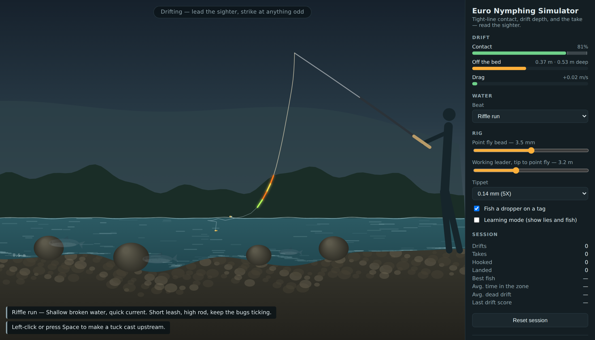

# Euro Nymphing Simulator

A browser simulator for tight-line (Euro) nymphing. No install, no build step, no
dependencies — open `index.html` and fish.



It is not a fishing arcade game. The point is the thing that is genuinely hard to
learn on the water and impossible to see once your flies are under the surface:
**where your nymphs actually are, and how much slack is between them and your
hand.** The simulator draws the whole system in cross-section so you can watch
the leader bag out, watch the point fly ride up out of the zone, and watch a fish
eat and spit while your sighter never twitches.

## Running it

**On a computer:** open `index.html`. That is the whole thing — it works straight
off the filesystem.

**On a phone or tablet:** use `dist/euro-nymphing-simulator.html` instead. It is
the same simulator with the stylesheet and all six scripts inlined into one file.
Android and iOS open downloaded files through a `content://` (or equivalent)
provider that cannot resolve relative paths to sibling files, so the multi-file
version loads as bare unstyled HTML with no canvas. The bundle has no external
references at all and works anywhere.

If you would rather serve it:

```sh
python3 -m http.server 8000
# then http://localhost:8000
```

Rebuild the bundle after changing anything in `src/` or `index.html`:

```sh
node tools/build-single-file.js
```

## Playing it

There are no cast or strike buttons. Everything is done with the rod.

| Action | Input |
| --- | --- |
| Hold the rod tip | move the pointer |
| Cast | sweep the rod: load back, drive upstream, stop |
| Strike | sweep the rod tip up |
| Gather line (while a fish is on) | hold the pointer button, or <kbd>Space</kbd> |
| Reset the rig under the tip | <kbd>R</kbd> |
| Tuck cast (fallback) | <kbd>C</kbd> |
| Learning mode (reveal lies and fish) | <kbd>L</kbd> |
| Pause | <kbd>P</kbd> |
| Switch beat | <kbd>1</kbd> <kbd>2</kbd> <kbd>3</kbd> |

The natural way to strike is the real one: sweep the rod tip up, or up and
slightly downstream. A lift is measured as how much ground the tip gained on a
lagged copy of itself over the last fifth of a second, so it reads the *gesture*
rather than raw speed — easing the rod up through a drift never trips it, a sharp
sweep always does. Measured on both mouse and touch, leading a drift peaks around
0.12 while a deliberate sweep lands between 0.45 and 0.71, against a default
trigger of 0.26. There is a sensitivity control, and you can turn it off.

On a touchscreen a tap cannot mean both "put the rod here" and "strike" — you
would set the hook every time you moved the rod. So on touch devices the water
only aims the rod, a flick up sets the hook, and a round button handles casting
and gathering line. This switches on automatically.

The loop: sweep the flies upstream, lead the sighter downstream at the speed of
the water, keep the contact meter in its band, and lift at anything the sighter
does that the current cannot explain. Then keep a bend in the rod, give line when
it runs, and drop the rod tip to lead a beaten fish to your feet.

Casting is a real cast, not a button. The leader is a rope with mass on the end,
so you load it by moving the rod back, drive it upstream, and stop — the stop is
what unloads it and throws the flies. A slow drag just tows them. A good sweep
gains one to three metres of upstream water; do it twice to reach the top of the
run. **Nothing anywhere in the simulator asks how the flies got wet** — a fly in
the water is fishing, full stop.

Three beats, each of which wants a different rig:

- **Riffle run** — shallow, quick, forgiving. Short leash, high rod.
- **Deep pocket** — you will not reach the bottom on the default rig. Lengthen the
  leader and go heavier.
- **Glassy tailout** — slow and clear. Fish see drag instantly and spook.

## What is actually simulated

The behaviour is emergent, not scripted. Four models do the work.

**The current** (`src/river.js`) is a 1/6-power boundary layer over a smoothed bed
profile: the water dies to nothing at the stones and runs fastest at the surface.
Continuity gives shallow water more speed than deep water, so a riffle rips and a
pocket loafs. That velocity gradient is the reason a nymph in the bottom 30 cm
gets a slow, natural drift while your leader up in the fast water is being dragged
downstream ahead of it.

**The leader** (`src/rig.js`) is a position-based-dynamics rope of 28 nodes. Two
details make it behave like real tackle:

- Segment constraints only ever *pull*. Slack is real slack, so a belly forms and
  stays until you take it up.
- Drag is applied as exponential relaxation toward the local water velocity, with
  a rate per material. Thin mono is drag-dominated and effectively rides the
  current; a tungsten bead is mass-dominated and keeps sinking through it. The
  bead sizes are tuned to real still-water sink rates (2.5 mm ≈ 0.24 m/s,
  4.5 mm ≈ 0.52 m/s).

Bed and boulder collision with tangential friction gives you the ticking — and
the anchored, dragging nymph when you go too heavy.

Fishing state is derived, never declared. A drift begins when the point fly goes
under and ends when it comes out or reaches you; trout evaluate any fly that is
in the water. An earlier version gated all of this behind a cast button, so flies
flicked out by hand drifted through a lie completely ignored — the kind of bug
that only a state machine can produce.

**The fish** (`src/fish.js`) judge a fly the way a trout would: how close it is,
how near the bed it is, and how far its velocity differs from the water around it.
Interest accumulates while the fly is good and decays when it is not; a fly towed
across the window spooks them instead. A fish that eats holds the fly for
somewhere between 0.8 and 1.1 seconds, and the only reason you ever find out is
that its turn tugs the leader — which reaches your sighter only in proportion to
how tight you were.

Hook-up probability is a direct function of contact at the moment you lift, and
of how long you took. Fishing well pays twice: a better drift makes a fish take
more confidently, which also means it holds on longer and gives you more time to
react. With ordinary contact (0.75–0.85) and an ordinary reaction (0.45–0.60 s)
you convert 57–79% of takes; with a slack leader (0.65) that falls to about 45%,
and with a genuinely tight one (0.95) it reaches 85–90%.

**The fight** treats rod and leader as a spring with about half a metre of give,
so load builds instead of snapping instantly. Hold on through a surge and you pop
the tippet; let go and line slips under load. A fish is landed at your feet, not
at the rod tip, which is why you have to drop the rod at the end.

## Layout

```
index.html        markup, HUD, controls
dist/             generated single-file bundle (do not edit by hand)
tools/            the bundler
src/style.css     styling
src/river.js      bed geometry, velocity field, the three beats
src/rig.js        leader physics (PBD rope, drag, bed collision)
src/fish.js       holding, judging a drift, taking, fighting
src/game.js       phases, scoring, the coach
src/render.js     canvas drawing
src/main.js       input, frame loop, HUD updates
```

Plain scripts on a shared `EN` global — no modules, so it runs off the filesystem.
`window.EN.game` is exposed if you want to poke at the running sim from the
console.

## Tuning

The numbers worth playing with:

- `src/river.js` — `PRESETS`: bed profiles, `flow`, `spook`, and where the lies are.
- `src/rig.js` — `DEFAULTS` and `beadSinkRate()`.
- `src/fish.js` — the interest rate in `updateHolding`, `hookChance`, and the
  fight constants in `updateHooked`.
- `src/game.js` — drift scoring thresholds, the coaching rules in `_scoreDrift`,
  and `LIFT_LAG` / `LIFT_DEFAULT` for hookset detection.

## Licence

MIT. See [LICENSE](LICENSE).
